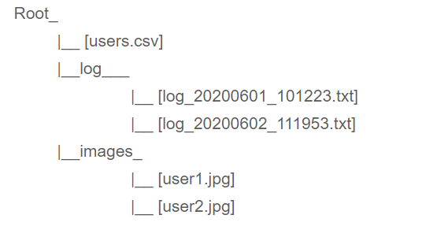
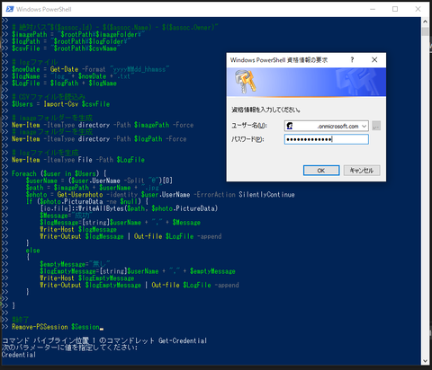
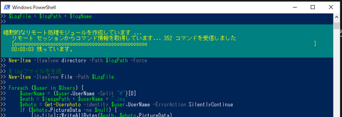
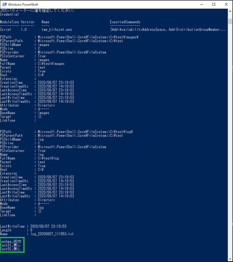
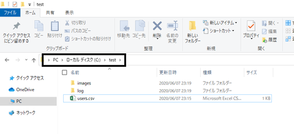
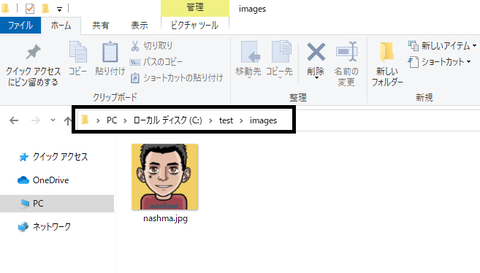
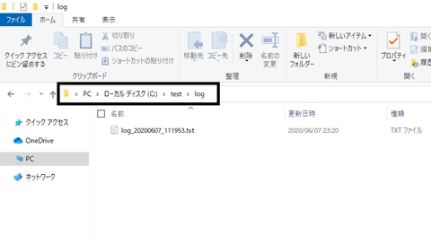
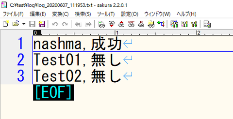

# Microsoft365.GetUserProfileImage
ユーザーのプロファイルイメージを一括ダウンロードする(How to bulk download user profile images) 
PowerShellにてExchange Online に接続してユーザーのプロファイルイメージをダウンロードする方法をメモしました。

## 仕様： 
1. 「users.csv」に指定されたユーザーのプロファイルイメージをダウンロードし、同じフォルダーにある「images」フォルダーに格納する。
2. ユーザー名でイメージファイルを命名する。
3. ログファイルを生成して「log」フォルダに格納する。

## 事前準備：
1. 始める前に把握しておくべき情報により、パソコンの設定を確認する。 
2. ローカルの任意のフォルダーを用意する。 
3. $rootPathの内容を２で用意した絶対パスに置き換える。 
4. 下記のuser.csvサンプルのようにファイルを作成し、特定ユーザーのメールアドレスを記入する。 

## 構造：
                        
                             
## サンプルの「users.csv」：
**UserName **
user1@domain.com 
user2@domain.com 
user3@domain.com 

## 処理の実施：
PowerShellで実行して認証情報を記入する。

  
  
  

## 結果確認：

  
  
  
  

## 参考：
[特定ユーザーのプロファイルイメージを一括ダウンロードする方法](http://nashma.blog.jp/archives/%E7%89%B9%E5%AE%9A%E3%83%A6%E3%83%BC%E3%82%B6%E3%83%BC%E3%81%AE%E3%83%97%E3%83%AD%E3%83%95%E3%82%A1%E3%82%A4%E3%83%AB%E3%82%A4%E3%83%A1%E3%83%BC%E3%82%B8%E3%82%92%E4%B8%80%E6%8B%AC%E3%83%80%E3%82%A6%E3%83%B3%E3%83%AD%E3%83%BC%E3%83%89%E3%81%99%E3%82%8B%E6%96%B9%E6%B3%95.html)
